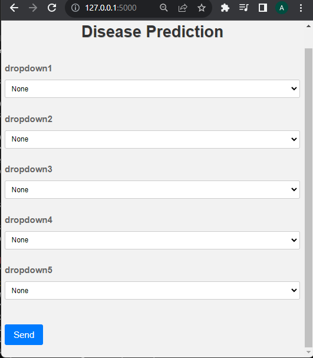

# Disease Detection Project
### Disease Detection

Welcome to the Disease Detection Project! This repository contains the code for training models on the General Health Disease Prediction dataset. Additionally, a Flask application has been developed to perform inference using the trained model. The dataset used in this project can be found at Kaggle.

https://www.kaggle.com/code/pranithchowdary/general-health-disease-prediction

The goal of this project is to build a disease detection system that can predict the presence of various diseases based on a set of input features from the General Health Disease Prediction dataset. The dataset contains a collection of health-related features, and we use a Scalar Vector Classifier to classify the samples into different disease categories.

## Dataset
The dataset used for this project can be accessed from the following Kaggle link: 

https://www.kaggle.com/code/pranithchowdary/general-health-disease-prediction

General Health Disease Prediction. The dataset consists of anonymized health records, and it includes features related to age, gender, vital signs, and other health-related metrics. The target variable is the presence or absence of different diseases.

## Installation
To get started with this project, you'll need to clone this repository to your local machine using the following command:

```
git clone https://github.com/ALI7861111/Disease-Detection-Machine-Learning.git

cd disease-detection-project
```
Next, to install the required dependencies:

```
pip install -r requirements.txt
```

## Training the Model

Before running the Flask application, you can train your own model on the provided dataset. To train the model, run the following command:

```
# For training a SVM model
python train_model.py --model="svm"

```

```
# For training a Random Forest model
python train_model.py --model="random_forest

```

```
# For training a Decision Tree model
python train_model.py --model="decision_tree"

```

## Flask Application

The Flask application allows you to perform inference using the trained SVC model. To run the Flask app, use the following command:

The trained model needs to be placed inside the folder
```
./Disease-Detection-Machine-Learning/Flask application/trained_model/mode.sav
```


```
cd Flask application
python app.py
```

The Flask application will be accessible at http://127.0.0.1:5000/ in your web browser.





## Usage

Once the Flask application is up and running, open the provided link in your web browser.
Fill in the required input features in the form provided on the web page.
Click the "Predict" button to get the prediction results for disease detection based on the provided inputs.

## Contributing

We welcome contributions to this project! If you find any issues or want to add new features, please feel free to open a pull request. We appreciate your help in making this project better.

## License

This project is licensed under the MIT License.

Thank you for exploring our Disease Detection Project! If you have any questions or feedback, please don't hesitate to contact us. Happy coding!